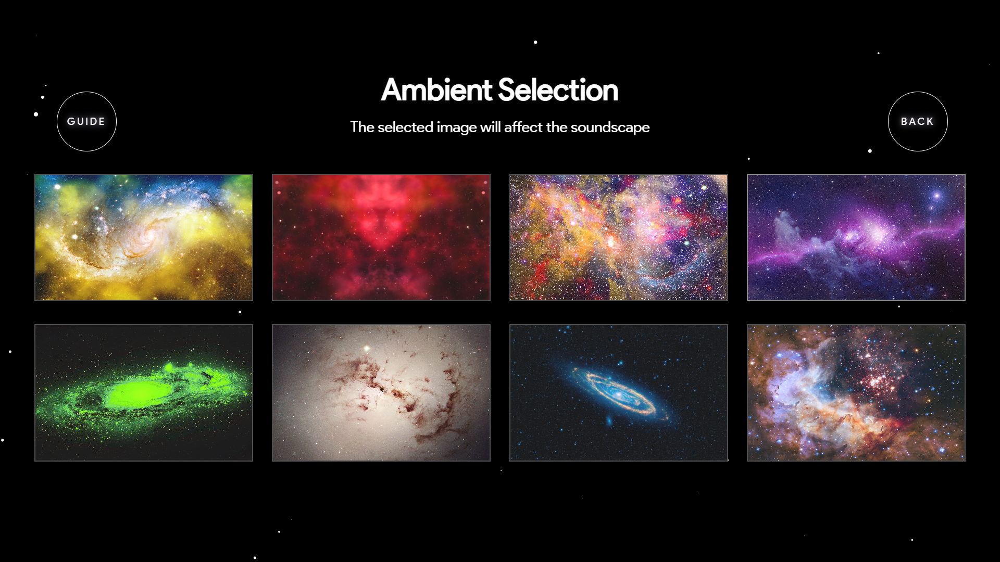
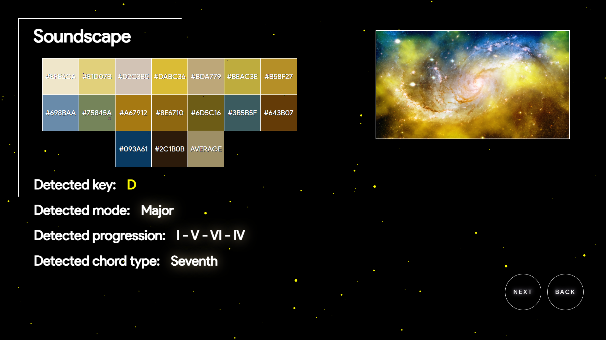
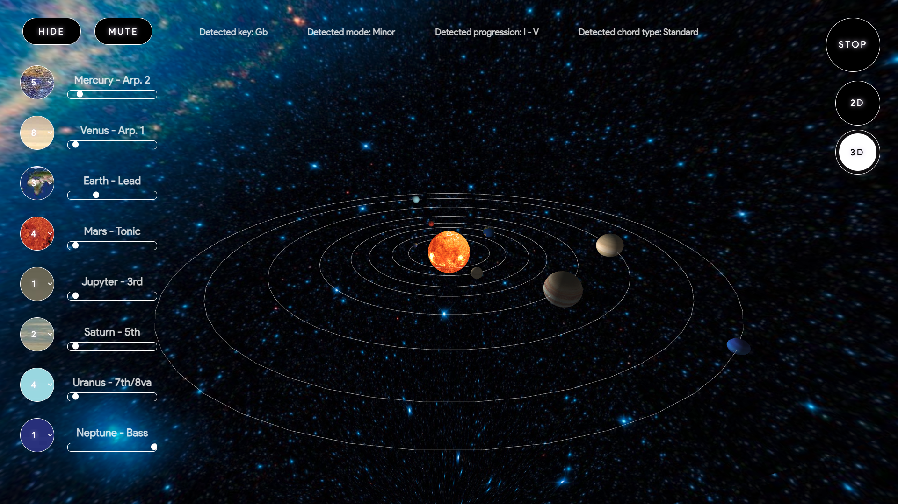
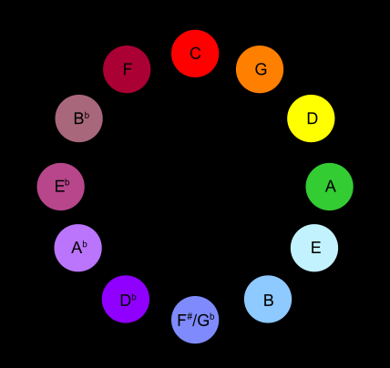
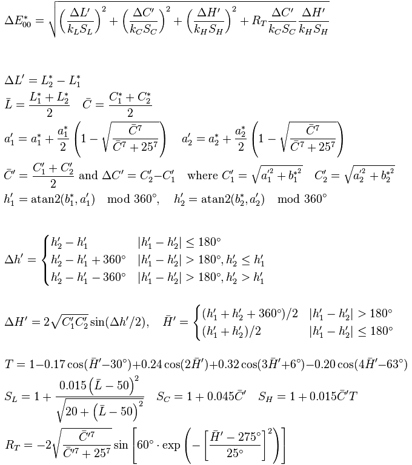
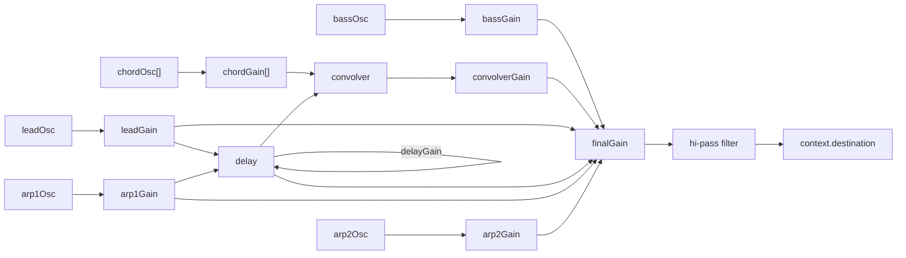

# THE SOUND OF SPACE

This project was developed in the context of the "**_Advanced Coding Tools and Methodologies_**" course held at [Politecnico di Milano](https://www.polimi.it/) for the Master's Degree in [Music and Acoustic Engineering](https://suono.polimi.it/). The task was to design and implement a musical web application based on the `HTML`/`CSS`/`JavaScript` framework.

</br>

The system can be tested by the user in two ways: 

- <a href="http://albertodoimo.github.io/" target="_blank" rel="noopener noreferrer">Hosted Website</a>
- Downloading the whole project from GitHub and running it using VS CODE live server
 

## Table of Contents

- [THE SOUND OF SPACE](#the-sound-of-space)
  - [Table of Contents](#table-of-contents)
  - [_Concept_](#concept)
  - [Overview](#overview)
    - [_Environment Selection_](#environment-selection)
    - [_Extracted Parameters_](#extracted-parameters)
    - [3D Visualizer](#3d-visualizer)
  - [Key Computation - _Average Color_](#key-computation---average-color)
    - [Delta E 2000 - More Information](#delta-e-2000---more-information)
  - [Mode Computation - _Brightness_](#mode-computation---brightness)
  - [Chord Type Computation - _Lightness_](#chord-type-computation---lightness)
  - [Chord Progression Computation - _Palette Extraction Algorithm_](#chord-progression-computation---palette-extraction-algorithm)
    - [Image Data Extraction](#image-data-extraction)
    - [Color Quantization: the _Median Cut_ algorithm](#color-quantization-the-median-cut-algorithm)
    - [Palette Building](#palette-building)
  - [Graphical Implementation](#graphical-implementation)
  - [Sound Implementation](#sound-implementation)
    - [Musical Style](#musical-style)
    - [Framework's choice](#frameworks-choice)
    - [Notes calculation from Image Processing data](#notes-calculation-from-image-processing-data)
    - [Oscillators, Gain and Effect Nodes](#oscillators-gain-and-effect-nodes)
    - [Loops and Envelopes](#loops-and-envelopes)
    - [Controls](#controls)
    - [Planets and Audio Synchronization](#planets-and-audio-synchronization)

</br>

## _Concept_

The chosen architecture is that of a **generative computer music system**. Starting from an interactive, space-themed environment, the user is supposed to choose a picture from a pre-selected set of images representing stars and galaxies. The application then uses complex image processing algorythms to extract qualitative **_visual data_** from the picture (namely, its _color palette_, its _brightness_, etc.) and converts them to **_musical data_** (that is _mode_, _key_, _progression_, etc.), that are finally used to generate in real-time a **procedurally sequenced musical piece**. The result is achieved by sequencing different instruments and interlacing their _cyclic behaviour_ according to different ratios. The resulting piece will have a **strong ambient flavor**, to reference the kind of soundscape people usually associate to space.

It is also possible to receive visual feedback about the musical fabric via the themed **_tridimensional graphical user interface_**, which associates each played instrument to a revolving planet of the Solar System, as if it were a sort of drum machine.

</br>

## Overview

The application is structured in three web pages: the **_environment selection_** one, the that displays the **_extracted parameters_** and finally the **_graphical interface_**. The user can choose to be led through each one of them _step by step_, by selecting the appropriate `GUIDE` button.

From a coding perspective, the data relative to the user's selections and the extracted parameters is saved and retrieved across pages by means of the `localStorage` read-only property of the `window` interface. This allows access to a `Storage` object for the `Document`'s origin, enabling the **_stored data_** to be **saved across browser sessions**.

### _Environment Selection_

The first page introduces the project and the set of pictures, inviting the user to make his selection. Each image was carefully selected based on its _unique features_, in order to generate a visibly different piece for each possible choice.

</br></br>

</br></br>

### _Extracted Parameters_

The second page displays the user-selected image and the extracted features, both visual and musical. On the left hand side are shown the **_color palette_**, the **_key_**, the **_mode_**, the **_chord progression_** and the **_chord type_**.
</br></br>


</br></br>

_The algorithms on which the extraction of the musical features from the image is based will be discussed in detail in a specific section, along with the corresponding visual parameters_. Here we report the correlations between the visual and the musical parameters:

---

- Average **Color** $\longrightarrow$ [_Key_](#key-computation---average-color)
- Average **Brightness** $\longrightarrow$ [_Mode_](#mode-computation---brightness) (Major/Minor)
- Chromatic Variety (**Palette Dimension**), **Brightness** and **Lightness** $\longrightarrow$ [_Chord Progression_](#chord-progression-computation---palette-extraction-algorithm)
- **Lightness** $\longrightarrow$ _Triad/Tetrad_

---

</br>

### 3D Visualizer

The last page is meant to give a visual representation of the interweaving musical textures by means of a graphic design inspired to our Solar System's aesthetic. Each planet corresponds to a synthesized sound, and its _period of revolution_ is proportional to the ratio at which the corresponding note (or series of notes) is played. When the planet crosses the _median axis_ of the screen (refer to the position in which the planets are represented in the image below), the note attack is triggered.

</br>



As the GUI suggests, the user can:

- Set the _volume_ and the _playing ratio_ for each planet (left menu);
- _Mute_ all the planets;
- _Play_ and _stop_ the synth;
- Drag the mouse and/or scroll the mousewheel to _move in the 3D space_;
- Switch from a _tridimensional perspective_ to a _bidimensional_ one (and vice versa).

The musical specifications computed before are shown on the top of the screen. In addition, notice how the user-selected picture is _wrapped around the skybox_ of the tridimensional space.

</br>




## Key Computation - _Average Color_

The main idea behind the project revolves around the association between visual features, such as colors, and musical features, such as the tonality of a piece. There have been many attempts, throughout history, to perform an **association bewteen colors and musical tonalities**. One of the most famous is the "**Clavier à Lumières**", a musical instrument invented by **_Aleksandr Nikolaevič Skrjabin_**, a Russian pianist and composer who claimed to be a **synesthete**, in 1915. Skrjabin's instrument was basically a piano that projected a _colored light beam in correspondence of all notes or key changes_. The image on the side represents **Skrjabin's _key-to-color mapping_**. Notice how the colored keys, placed in the **circle of fifths**, form a _**spectrum**_: this led to a lot of doubts about the truthfulness of Skrjabin's claim of experiencing synesthesia. Nonetheless, it is an interesting approach, upon which we based our computation.

In order to compute the **average color** of the selected picture, a specific library was employed: `fast-average-color`. Once computed, the average color is fed to the `computeKey` function, that by means of the `Color.js` library computes the **perceptive distance** ([**Delta E 2000 algorithm**](#delta-e-2000---more-information), see below for reference) between the average color and each of the reference colors associated with the 12 keys according to Skrjabin and returns the key corresponding to the minimum color distance. Each color is defined employing the _**proprietary color object provided by the library**_.

```javascript
// Color.js --> Reference Color Objects
var ut = new Color("srgb", [255, 0, 0]);
var sol = new Color("srgb", [250, 120, 0]);
var re = new Color("srgb", [250, 250, 0]);
var la = new Color("srgb", [0, 255, 0]);
var mi = new Color("srgb", [190, 255, 255]);
var si = new Color("srgb", [50, 190, 250]);
var sol_b = new Color("srgb", [110, 60, 250]);
var re_b = new Color("srgb", [160, 0, 255]);
var la_b = new Color("srgb", [200, 125, 250]);
var mi_b = new Color("srgb", [255, 0, 0]);
var si_b = new Color("srgb",[150, 80, 120]);
var fa = new Color("srgb", [100, 0, 0]);

const computeKey = (avg) => {
  let color1 = new Color({space: "srgb", coords: [avg[0], avg[1], avg[2]]});
  let min = color1.deltaE2000(dict.C);
  let color_key;
  let diff = [];
  let i = 0;

  for (const [key, value] of Object.entries(dict)) {
    diff = color1.deltaE2000(value);
    if (diff < min) {
      color_key = key;
      reference = value.coords; 
      // reference is the RGB color code of the Scriabin's color associated with 
      // the returned key. The Color.js method ".coords" returns as an array the 
      // RGB coordinates of the color
      min = diff;
    }
  };
  return [color_key, reference];
};
```

---

### Delta E 2000 - [More Information](http://zschuessler.github.io/DeltaE/learn/)

Delta E is a **metric** that aims at being compatible with the human eye color perception. On a typical scale, the $\Delta E$ value ranges from 0 to 100, and from a _qualitative point of view_ the ranges can be described as follows:

<center>

| $\Delta E$ | Perception |
| ----------- | ----------- |
| $\le1.0$ | Not perceptible by human eyes. |
| $1-2$ | Perceptible through close observation. |
| $2-10$ | Perceptible at a glance. |
| $11-49$ | Colors are more similar than opposite. |
| $11-49$ | Colors are exactly opposite. |

</center>

There are three $\Delta E$ algrithms, and there are quite a few inconsistencies between them. $\mathbf{\Delta E_{2000}}$ (the one employed in the project) **is the most recent, complex and accurate one**.

</br>

<center>

</center>

</br>

We should like to reiterate the qualitative nature of the algorithm by means of a quote:

> _Delta E accuracy must be confirmed through the very tool it was meant to 
> remove subjectivity from: a pair of human eyes_.
> -- [Reference](http://zschuessler.github.io/DeltaE/learn/)

---

</br>

## Mode Computation - _Brightness_

To estimate the brightness of the picture we employed a simple yet effective approach. By averaging their RGB coordinates, we associated a **grey value** to each pixel and computed the total grey value of the image by summing over all the pixels of the image. We then determine the **light level** of the picture via normalization of the total grey value by the area of the canvas. Finally, _if the ratio falls below a certain threshold_ (arbitrarily set to 100, in this case) the image is dubbed dark. The condition is relaxed by means of a variable named `fuzzy`, which divides the area. The `isItDark()` function is entrusted with the described process:

```javascript
const isItDark = (imageData, c) => {
  var fuzzy = 1.5;
  var threshold = 100;
  var data = imageData.data;
  var r,g,b;
  var totalGrey = 0;

  for(let x = 0, len = data.length; x < len; x+=4) {
    r = data[x];
    g = data[x+1];
    b = data[x+2];
    grey = Math.floor((r+g+b) / 3);

    totalGrey += grey;
  }

  var area = (c.width * c.height) / fuzzy,
    lightLevel = Math.floor(totalGrey / area)
  
    return (lightLevel < threshold)
};
```

</br>

## Chord Type Computation - _Lightness_

At the design stage it was chosen to limit the quality of the progression chords to two possibilities: a simple **major/minor triad** and a **seventh tetrad**. In order to associate a chord species to the user-selected image, we employed an algorithm whose purpose was to determine _how bright the colors of the picture are_ (we refer to this feature as "**_lightness_**"). To do so, we simply counted how much pixels presented at least one RGB channel value above the 200 threshold, and normalized it on the total number of pixels. _The lightness threshold_ (0.02) _was determined_, as were all the other thresholds of the project, _**empirically**_.

```javascript
const seventh = (imageData, c) => {
  let data = imageData.data;
  let r,g,b, max_rgb;
  let light = 0;

  for(let x = 0, len = data.length; x < len; x+=4) {
    r = data[x];
    g = data[x+1];
    b = data[x+2];

    if (r >= 200 && g >= 200 && b >= 200)
      light++;
  }

  return [(light / (c.width*c.height) < 0.02), (light / (c.width*c.height))];
};
```

</br>

## Chord Progression Computation - _Palette Extraction Algorithm_

In the examined project, the color palette of the selected picture is associated to the complexity of the **chord progression** of the generated musical piece and to its **tonality**. Extracting a palette from an image means detecting a set of colors that capture the "mood" of the image. To do so, we followed the steps described below:

- Load the selected image into a canvas;
- Extract the image information;
- build an array of colors;
- apply **color quantization**.

The extracted palette is then ordered by luminance and appended to the HTML document to display it in the dedicated page.

</br>

### Image Data Extraction

The image is loaded into a `canvas` element by means of the `.onload` event handler. This allows us to access the image data, via the `gatImageData()` method of the canvas API. The `.onload` function handles all the computation related to the extraction of the picture data.

```javascript
img.onload = function() {
  c.height = img.height/3.5;
  c.width = img.width/3.5;
  ctx.drawImage(img, 0, 0, img.width/3.5, img.height/3.5);
  ctx.imageSmoothingEnabled = false;  // 
  const imageData = ctx.getImageData(0, 0, c.width, c.height);
  [...]
}
```

The data returned from `getImageData()` contains _all the pixels in the image_ in the following format:

```javascript
{
  data: [34,11,234,37,22,212,111,289...],
  colorSpace: "srgb",
  height: 720,
  width: 480
}
```

In order to ease the readability of the data set, we need to get rid of the pieces of information relative to the alpha channel, thus converting the data **from RGBA to RGB color space**. This is achieved by means of the `buildRgb()` function:

```javascript
const buildRgb = (imageData) => {
  const rgbValues = [];
  let c = 0;
  for (let i = 0; i < imageData.length; i += 4) {
    alpha_channel[c] = imageData[i + 3];
    c++;
    const rgb = {
      r: imageData[i],
      g: imageData[i + 1],
      b: imageData[i + 2],
    };
    rgbValues.push(rgb);
  }
  return rgbValues;
};
```

As said before, to build a palette we need to find a way to select the colors that represent the picture the most. In order to do so, we employed a **color quantization** algorithm.

</br>

### Color Quantization: the _Median Cut_ algorithm

</br>

>_Color quantization is a process that reduces the number of colors in images without
>loss of quality and of important global information._
> -- <cite>[Reference](https://link.springer.com/content/pdf/10.1007/978-3-540-85920-8_91.pdf)</cite>

</br>

To achieve this, we employed an implementation of the so-called **median-cut algorithm**. The sequence of steps on which the method is based is reported below:

1. Consider the entirety of the RGB values of _**all the pixels**_ of the image;
2. Find out which color channel (red, green or blue) has the **greatest range**;
3. **Sort the pixels** accordingly[^1].
4. After sorting the pixels, _the **upper half** of the pixels are moved into a new set_ and **the process is repeated** for each of the new subsets until the number of subsets equals the desided number of colors of the palette.
5. To finally obtain the palette, _the pixels in each set must be_ **averaged**.

[^1]: If the red channel has the greatest range, a pixel with an RGB value (12, 67, 255) is less than a pixel whose RGB value is (83, 150, 243), since 12 < 83.

The name of the algorithm comes from the fact that _the sets of pixels are divided into two at their median_. Here is the code for the `quantization()` and the `findBiggestColorRange()` functions:

```javascript
const quantization = (rgbValues, depth) => {
  const MAX_DEPTH = 4;

  // MAX_DEPTH: number of desired colors by power of 2 -> maximum of 16 colors per palette
  // in the examined case

  // BASE CASE: we enter it when our depth is equal to the MAX_DEPTH, in our case 4, 
  // then add up all the values and divide by half to get the average.

  if (depth === MAX_DEPTH || rgbValues.length === 0) {
    const color = rgbValues.reduce(
      (prev, curr) => {
        prev.r += curr.r;
        prev.g += curr.g;
        prev.b += curr.b;

        return prev;
      },
      {
        r: 0,
        g: 0,
        b: 0,
      }
    );

    color.r = Math.round(color.r / rgbValues.length);
    color.g = Math.round(color.g / rgbValues.length);
    color.b = Math.round(color.b / rgbValues.length);
    return [color];
  }

  // RECURSION
  const componentToSortBy = findBiggestColorRange(rgbValues);
  rgbValues.sort((p1, p2) => {
    return p1[componentToSortBy] - p2[componentToSortBy];
  });

  const mid = rgbValues.length / 2;
  return [
    ...quantization(rgbValues.slice(0, mid), depth + 1),
    ...quantization(rgbValues.slice(mid + 1), depth + 1),
  ];

};
```

### Palette Building

Once the desired depth has been reached and the average color for each pixels subset has been computed, it is time to actually build the palette. Notice how, for aesthetic purposes, the colors are firstly ordered by [**luminance**](https://developer.mozilla.org/en-US/docs/Web/Accessibility/Understanding_Colors_and_Luminance). For more information about _relative luminance_, please refer to the linked webpage. The relative code is reported below.

```javascript
// ORDERING BY LUMINANCE
const orderByLuminance = (rgbValues) => {
  const calculateLuminance = (p) => {
    return 0.2126 * p.r + 0.7152 * p.g + 0.0722 * p.b;
  };

  return rgbValues.sort((p1, p2) => {
    return calculateLuminance(p2) - calculateLuminance(p1);
  });
};

// COLOR DISTANCE computation
const calculateColorDifference = (color1, color2) => {
  const rDifference = Math.pow(color2.r - color1.r, 2);
  const gDifference = Math.pow(color2.g - color1.g, 2);
  const bDifference = Math.pow(color2.b - color1.b, 2);

  return rDifference + gDifference + bDifference;
};

// PALETTE BUILDING
const buildPalette = (colorsList) => {
  const paletteContainer = document.getElementById("palette");
  
  // Reset the HTML (just to be safe)
  paletteContainer.innerHTML = "";

  const orderedByColor = orderByLuminance(colorsList);

  for (let i = 0; i < orderedByColor.length; i++) {
    const hexColor = rgbToHex(orderedByColor[i]);

    if (i > 0) {
      const difference = calculateColorDifference(
        orderedByColor[i],
        orderedByColor[i - 1]
      );

      // If the color distance is less than 120 we consider the color too similar to the
      //  last one, and thus ignore it
      if (difference < 120) {
        continue;
      };
    };

    count++;

    // Creates the div and text elements for the color and the caption and appends it 
    // to the document
    const colorElement = document.createElement("div");
    colorElement.style.backgroundColor = hexColor;
    colorElement.appendChild(document.createTextNode(hexColor));
    paletteContainer.appendChild(colorElement);
  };
};
```

Notice how the color difference is computed via a simple **Euclidean distance**:

$$ d^2 = (R_2-R_1)^2+(G_2-G_1)^2+(B_2-B_1)^2 $$

The color complexity (i.e. the _number of colors in the palette_) was initially supposed to affect the **complexity of the chord progression** of the generated music piece. Since most of the palettes extracted from the selectable images reached the $2^4=16$ colors limit, we normalized the values on the light level computed via the `seventh()` function and the grey value computed via the `isItDark()` function (the variable `count` stores the number of colors in the palette):

```javascript
light = (seventh(imageData, c)[1] < 0.1) ? 0.1 : seventh(imageData, c)[1];
grey = isItDark(imageData, c)[1]
token = count * light * grey;
  
if (token < 50) {
  param.p = 5;
  document.getElementById("prog").textContent = "I - V";
} else if (token > 50 && token < 150) {
  param.p = 4;
  document.getElementById("prog").textContent = "I - VI - IV";
} else if (token > 150 && token < 250) {
  param.p = 3;
  document.getElementById("prog").textContent = "I - IV - VI - V";
} else if (token > 250 && token < 300) {
  param.p = 2;
  document.getElementById("prog").textContent = "I - IV - II - V";
} else if (token > 300) {
  param.p = 1;
  document.getElementById("prog").textContent = "I - V - VI - IV";
}
```

</br>

## Graphical Implementation

In order to generate a 3D environment we relied on `p5.js`, a JavaScript library for _creative coding_. In particular, we focused on its ability to simplify the `WebGL` implementation. When creating the `canvas` in the `setup` function of p5, we declare a third parameter, `WEBGL`, which sets the environment to 3D:

```javascript
function  setup() {
  createCanvas(windowWidth, windowHeight, WEBGL);
  [...]
}
```

Additionaly, in order to allow the user to control the camera point in the 3D perspective, we employed another library, `p5.EasyCam` which is also declared in the `Setup` function as follows:

```javascript
 easycam = createEasyCam();
 easycam.setState(tri);
```

This library offers the possibility to set various parameters for example the minimum and maximum distance from the center of view and some predefined states among witch the user can switch with the perspective buttons of the GUI.

The planets have a dedicated function to which an array of values, one for each planet, is passed in the instantiation of the object. In this function several p5 features are used:

- The planet is created as polygonal sphere with the `sphere(diameter);` code;
- The planet is textured by clamping an image, previously loaded in the `preload` function, with the p5 expressions `textureWrap(CLAMP);` and `texture(skin);`
- The planet rotates around his axis by means of the function `rotateY(frameCount * rotation);`
- The Earth is the only planet whose rotation axis is tilted with respect to the elliptical plane and this is achieved through the following code:`rotateZ(tilt);`
- The ellipse is drawn by means of `ellipse(0, 0, orbitWidth*2, orbitHeight*2)`;
- The planet is tranlsated along his revolution ellipse by the following expression:

  ```javascript
   translate(
    sin(revolutionRate*movePlanet) * orbitWidth, 
    0,
    cos(revolutionRate*movePlanet) * orbitHeight
   );
  ```

  where `movePlanet` is a variable used to control if the planet is moving or not and which therefore can assume the values 0 or 1. Note that the revolutionRate value is linked to the `audioContext currentTime` as to sync the planets with the amplitude envelopes of the synths.

The `planet()` function will finally be called one time for each planet inside the `draw()` function of p5.

## Sound Implementation

### Musical Style

Given the concept of representing the sound through a sort of rhythmic wheel which consists of the planets of the Solar System, we decided to keep the musical style consinstent with the environment and therefore we tried to achieve a space-like flavour for the sound. Ambient music has surely been our greatest influence in this field and in particular the drone-like, slowly-raising synths of the "Blade Runner" soundtrack by the great Vangelis, along with most of Brian Eno's works.

### Framework's choice

The sound was originally implemented with the library `Tone.js` because of its intuitiveness and its various features, in particular the transport functions to play and pause the loops and the easiness of implementation. Unfortunately, as the project was increasing in complexity during the final stages of work, we discovered that `Tone` is very inefficient and heavy computationally-wise, so we re-implemented the sound using the `AudioContext` environment which did the job very nicely.

### Notes calculation from Image Processing data

From the image processing we get the following data:

- Detected key
- Mode (major or minor)
- Chord progression
- Tetrad type

These informations are processed in order to generate an array of frequecies for each synth/planet. The synth will then cycle through this sequence according to its ratio of playing. The bass notes, for example, are extracted from the selected scale, mode and chord progression as follows:

```javascript
let  bassNotes = [];

for (i = 0; i < selectedProgression.length; i++) {
  bassNotes[i] = getNoteFreq(selectedMode[selectedProgression[i] - 1], 2);
}
```

For what concerns the the chord notes we applied a **2:1 subsampling starting** from the detected scale. Lead notes (which are played by the Earth) **are generated randomly from the pentatonic scale** of the key and this translates in a semi-generative design. Finally the first arpeggiator cycles through the notes of the whole scale while the second one plays the notes of the chord sequentially.

### Oscillators, Gain and Effect Nodes

The first step in the creation of sound is the generation of the oscillators: `context.createOscillator().`This occours in the `SoundDesign` function, where all nodes are created and connected.
Each planet has its own oscillator, in particular, every oscillator is a sine wave exept for the chord planets i.e. Uranus Saturn Jupiter and Mars which are characterized by a square wave. The waveform of the oscillator is set as follows: `osc.type="sine";`

Each oscillator has its volume controlled by a `gainNode` which is instanciated this way:
`context.createGain()`. In addition to this, a final gain has been created as to control the master volume of the application.

Moreover some effects are being created:

- A `convolver` reverb, to which an impulse responce buffer was fed:
  `convolver = new  ConvolverNode(context,{buffer:impulse})`
  The impulse buffer is actually being created by the function `impulseResponce(duration, decay)` which basically fills every sample of the buffer with a random value between -1 and 1 scaled by a decreasing exponential which slope is linked to the `duration` and `decay` parameters. The `convolver` also has its `gainNode`;
- A `delay` which is connected through a feedback loop with its gain (the gain value will control the amount of feedback) `delay = context.createDelay` which time can be set as follows: `delay.delayTime.value=...`;
- An `high-pass filter` which is used to cut undesired frequencies before the output: `hi_filter= new  BiquadFilterNode(context)`which cutoff frequency can be set by: `hi_filter.frequency.value=...`;

The connection between the various nodes is reported in the graph below:



### Loops and Envelopes

Each planet has its own `play` function which controls the notes to be played and the envelope applied to the gain of the synth. An index cycles thorugh the array of frequencies that will be played every time the function is called. At the same time the `gainNode` gain is linearly shaped to reach the desired volume before going back to 0. In other terms the synth is being shaped by a triangular-shaped envelope.

```javascript
let  bassNotesIndex = 0;
function  playBass()
{
  bassGain.gain.value = 0;
  bassOsc.frequency.value = bassNotes[bassNotesIndex];
  if (bassNotesIndex < bassNotes.length-1) { bassNotesIndex++; }
  else { bassNotesIndex = 0; }
  t0 = context.currentTime;
  t1 = t0 + Number(msRep/planetRatios[7]/1000/2);
  t2 = t1 + Number(msRep/planetRatios[7]/1000/2);
  bassGain.gain.linearRampToValueAtTime(volumes[0], t1);
  bassGain.gain.linearRampToValueAtTime(0, t2);
}
```

These function are then scheduled with the respective ratios by the `PlaySound()` function which is called once the play button is pressed:

```javascript
bassLoop = setInterval(playBass, msRep/planetRatios[7]);
```

Once the stop button is pressed the `stopSound()` function is called, which will clear the scheduled intervals and set the volumes to 0.

### Controls

- The user can set the volume of a synth by adjusting the correspondent slider. Once this is done the `changeVolume()` function is called which adjusts the corresponding value of the array `volumes[]`.
- The mute button sets all the values of the array `volumes[]` to 0 after saving the values on a temporary array which will be used to restore the volumes once the unmute button is pressed.
- Finally, in order to change the ratio of playing of a planet we needed to stop the whole sound as to be able to re-schedule the `play` function of that planet without loosing the sync with the others. The `changeRatio()` function therfore sets the new value of the array `planeRatios[]` and calls the `stopSound()` function. The user will then need to hit the play button once again and wait for the planets to sync and start playing again.

### Planets and Audio Synchronization

As we already mentioned in the Graphical Implementation section, the planets move synchronously with the audio. In particular the synth will start playing a new note when the corresponding planet passes the closest vertical semiaxis of the ellipse it is tracing. The volume (controlled by the envelope) will reach its maximum when the planet passes the opposite semiaxis. This is achieved in the following way:
The planets trace their orbit in the exact time interval that schedules the callback of the function `play` for each planet. Here we report the value that controls the translation along the ellipse (the translation code has already been reported in the graphical section):

```javascript
revolutionRate = 2*Math.PI*(context.currentTime/(msRep/modifier/1000));
```

where `msRep` is a constant that defines the general bpm of the system and `modifier` is the `planetRatio[]` value passed to the `planet()` function.

At the same time the planets need to be synched with the sound as to avoid phase shifts between motion and sound. This task is performed by the `synch()` function which checks if: `sin(revolutionRate)==0 && cos(revolutionRate)==1`. If the condition is true the planets and the audio are synchronized so the planets can start moving `movePlanet=1;` and the audio can start playing `playSound();` During the time needed for this to happen a loading text is displayed.
