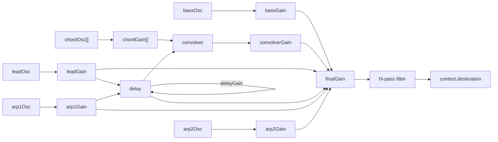

# **THE SOUND OF SPACE**

This project was developed in the context of the "Advanceed Coding Tools and Methodologies" course held at [Politecnico di Milano](https://www.polimi.it/) for the Master's Degree in [Music and Acoustic Engineering](https://suono.polimi.it/). The task was to design and implement a musical web application.
This project has the aim of create a space environment where the user can be admire images of the universe and interact with them. Sounds are generated by an algorhythm of image-processing and they can be modified by the user to adapt music to its taste.


# ENRICO PUSH

# Third page, solar system and audio

After the image processing and the conversion to musical parameters is completed, the user can proceed to the following page. 
As the GUI suggests the user can:
- Set the volume and the ratio of playing for each planet from the left menu
- Mute all planets 
- Play and stop the synth
- Drag the mouse and scroll the mousewheel to move in the 3D space.
- Switch from a 3D perspective to a two-dimensional one and vice versa. 

Moreover, the GUI displays the musical specifications calculated before on the top part of the screen in order to allow the user to have a direct feedback on what he is hearing.

IMAGEEEEEEEEEEEEEEEEEEEEEEEEEEEEEEEEEEEEEE

 Graphical Implementation
-
In order to generate a 3D environment we relied on p5.js, a JavaScript library for creative coding. In particular we focused on its capabilities of simplifying the WEBGL implementation. When creating the `canvas` in the `setup` function of p5, we declare a third parameter, `WEBGL`, which sets the environment to 3D:
```
function  setup() {
	createCanvas(windowWidth, windowHeight, WEBGL);
```
Additionaly, in order to allow the user to control the camera point in the 3D perspective, we employed another library, `p5.EasyCam` which is also declared in the `Setup` function as follows:
```
	easycam = createEasyCam(); 
	easycam.setState(tri);
```
This library offers the possibility to set various parameters for example the minimum and maximum distance from the center of view and some predefined states among witch the user can switch with the perspective buttons of the GUI.

The planets have a dedicated function to which an array of values, one for each planet, is passed in the instantiation of the object. In this function several p5 features are used:
 - The planet is created as polygonal sphere with the `sphere(diameter);` code;
 - The planet is textured by clamping an image, previously loaded in the `preload` function, with the p5 expressions `textureWrap(CLAMP);` and `texture(skin);`
 - The planet rotates around his axis by means of the function `rotateY(frameCount * rotation);`
 - The Earth is the only planet whose rotation axis is tilted with respect to the elliptical plane and this is achieved through the following code:`rotateZ(tilt);`
 - The ellipse is drawn by means of `ellipse(0, 0, orbitWidth*2, orbitHeight*2)`;
 - The planet is tranlsated along his revolution ellipse by the following expression:
	```
		translate(
			sin(revolutionRate*movePlanet) * orbitWidth,
			0,
			cos(revolutionRate*movePlanet) * orbitHeight
		);
	```
	where `movePlanet` is a variable used to control if the planet is moving or not and which therefore can assume the values 0 or 1. Note that the revolutionRate value is linked to the `audioContext currentTime` as to sync the planets with the amplitude envelopes of the synths.

The `planet()` function will finally be called one time for each planet inside the `draw()` function of p5.

Sound Implementation
-
### Musical Style
Given the concept of representing the sound through a sort of rhythmic wheel which consists of the planets of the Solar System,  we decided to keep the musical style consinstent with the environment and therefore we tried to achieve a space-like flavour for the sound. Ambient music has surely been our greatest influence in this field and in particular the drone-like, slowly-raising synths of the "Blade Runner" soundtrack by the great Vangelis, along with most of Brian Eno's works.

### Framework's choice
The sound was originally implemented with the library `Tone.js` because of its intuitiveness and its various features, in particular the transport functions to play and pause the loops and the easiness of implementation. Unfortunately, as the project was increasing in complexity during the final stages of work, we discovered that `Tone` is very inefficient and heavy computationally-wise, so we re-implemented the sound using the `AudioContext` environment which did the job very nicely.

### Notes calculation from Image Processing data

From the image processing we get the following data:
- Detected key
- Mode (major or minor)
- Chord progression
- Tetrad type

These informations are processed in order to generate an array of frequecies for each synth/planet. The synth will then cycle through this sequence according to its ratio of playing. The bass notes, for example, are extracted from the selected scale, mode and chord progression as follows:
```
let  bassNotes = [];

for (i = 0; i < selectedProgression.length; i++) {
	bassNotes[i] = getNoteFreq(selectedMode[selectedProgression[i] - 1], 2);
}
```
For what concerns the the chord notes we applied a **2:1 subsampling starting** from the detected scale. Lead notes (which are played by the Earth) **are generated randomly from the pentatonic scale** of the key and this translates in a semi-generative design. Finally the first arpeggiator cycles through the notes of the whole scale while the second one plays the notes of the chord sequentially.

### Oscillators, Gain and Effect Nodes
The first step in the creation of sound is the generation of the oscillators: `context.createOscillator().`This occours in the `SoundDesign` function, where all nodes are created and connected.
Each planet has its own oscillator, in particular, every oscillator has a sine wave exept for the chord planets i.e. Uranus Saturn Jupiter and Mars which are characterized by a square wave. The waveform of the oscillator is set as follows: `osc.type="sine";`

Each oscillator has its volume controlled by a `gainNode` which is instanciated this way:
`context.createGain()`. In addition to this, a final gain has been created as to control the master volume of the application.

Moreover some effects are being created:
- A `convolver` reverb, to which an impulse responce buffer was fed: 
`convolver = new  ConvolverNode(context,{buffer:impulse})`
The impulse buffer is actually being created by the function `impulseResponce(duration, decay)` which basically fills every sample of the buffer with a random value between -1 and 1 scaled by a decreasing exponential which slope is linked to the `duration` and `decay` parameters. The `convolver` also has its `gainNode`;
- A `delay` which is connected through a feedback loop with its gain (the gain value will control the amount of feedback) `delay = context.createDelay` which time can be set as follows: `delay.delayTime.value=...`;
- An `high-pass filter` which is used to cut undesired frequencies before the output: `hi_filter= new  BiquadFilterNode(context)`which cutoff frequency can be set by: `hi_filter.frequency.value=...`;

The connection between the various nodes is reported in the graph below:


### Loops and Envelopes
Each planet has its own `play` function which controls the notes to be played and the envelope applied to the gain of the synth. An index cycles thorugh the array of frequencies that will be played every time the function is called. At the same time the `gainNode` gain is linearly shaped to reach the desired volume before going back to 0. In other terms the synth is being shaped by a triangular-shaped envelope.
```
let  bassNotesIndex=0;
function  playBass()
{
	bassGain.gain.value=0;
	bassOsc.frequency.value = bassNotes[bassNotesIndex];
	if(bassNotesIndex<bassNotes.length-1){bassNotesIndex++;}
	else{bassNotesIndex=0;}
	t0= context.currentTime;
	t1= t0+Number(msRep/planetRatios[7]/1000/2);
	t2= t1+Number(msRep/planetRatios[7]/1000/2);
	bassGain.gain.linearRampToValueAtTime(volumes[0], t1);
	bassGain.gain.linearRampToValueAtTime(0, t2);
}
```
These function are then scheduled with the respective ratios by the `PlaySound()` function which is called once the play button is pressed:
```
bassLoop = setInterval(playBass, msRep/planetRatios[7]);
```
Once the stop button is pressed the `stopSound()` function is called, which will clear the scheduled intervals and set the volumes to 0.

### Controls
- The user can set the volume of a synth by adjusting the correspondent slider. Once this is done the `changeVolume()` function is called which adjusts the corresponding value of the array `volumes[]`.
- The mute button sets all the values of the array `volumes[]` to 0 after saving the values on a temporary array which will be used to restore the volumes once the unmute button is pressed.
- Finally, in order to change the ratio of playing of a planet we needed to stop the whole sound as to be able to re-schedule the `play` function of that planet without loosing the sync with the others. The `changeRatio()` function therfore sets the new value of the array `planeRatios[]` and calls the `stopSound()` function. The user will then need to hit the play button once again and wait for the planets to sync and start playing again.

### Planets and Audio Synchronization
As we already mentioned in the Graphical Implementation section, the planets move synchronously with the audio. In particular the synth will start playing a new note when the corresponding planet passes the closest vertical semiaxis of the ellipse it is tracing. The volume (controlled by the envelope) will reach its maximum when the planet passes the opposite semiaxis. This is achieved in the following way:
The planets trace their orbit in the exact time interval that schedules the callback of the function `play` for each planet. Here we report the value that controls the translation along the ellipse (the translation code has already been reported in the graphical section):
```
revolutionRate = 2*Math.PI*(context.currentTime/(msRep/modifier/1000));
```
where `msRep` is a constant that defines the general bpm of the system and `modifier` is the `planetRatio[]` value passed to the `planet()` function.

At the same time the planets need to be synched with the sound as to avoid phase shifts between motion and sound. This task is performed by the `synch()` function which checks if: `sin(revolutionRate)==0 && cos(revolutionRate)==1`. If the condition is true the planets and the audio are synchronized so the planets can start moving `movePlanet=1;` and the audio can start playing `playSound();` During the time needed for this to happen a loading text is displayed.
